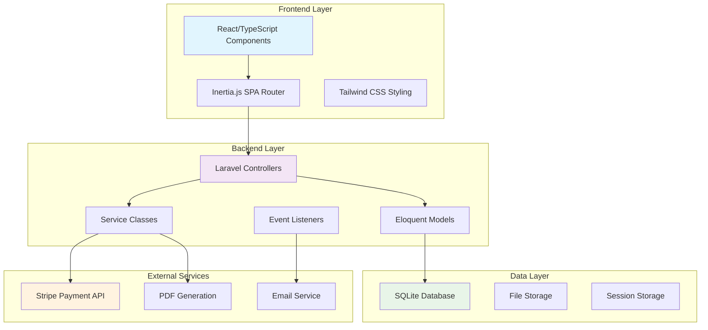
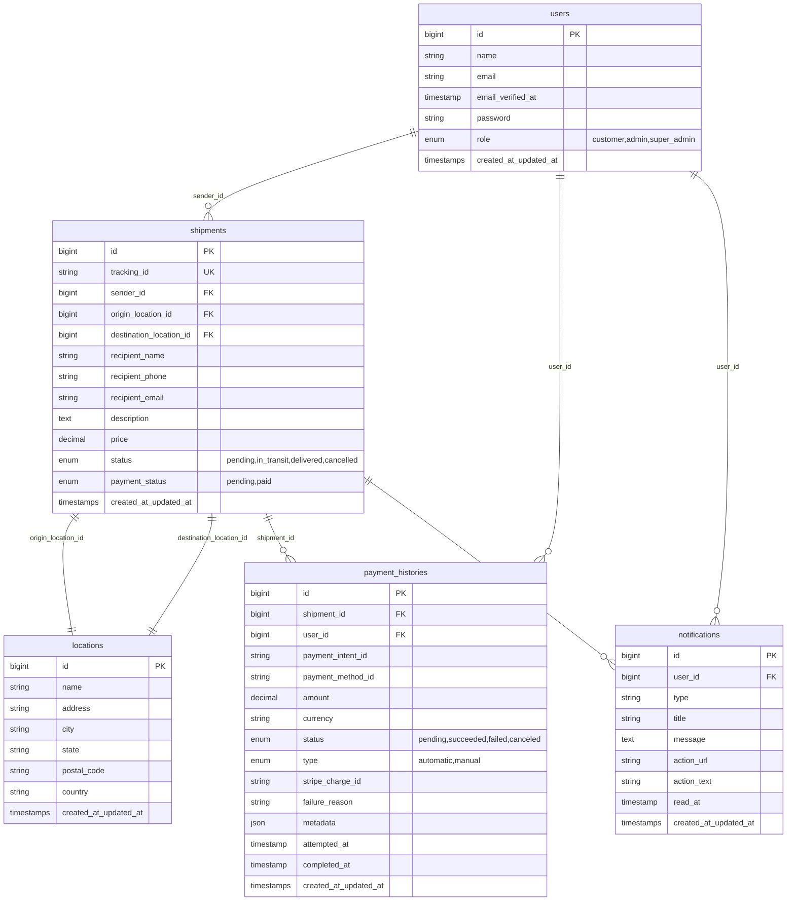
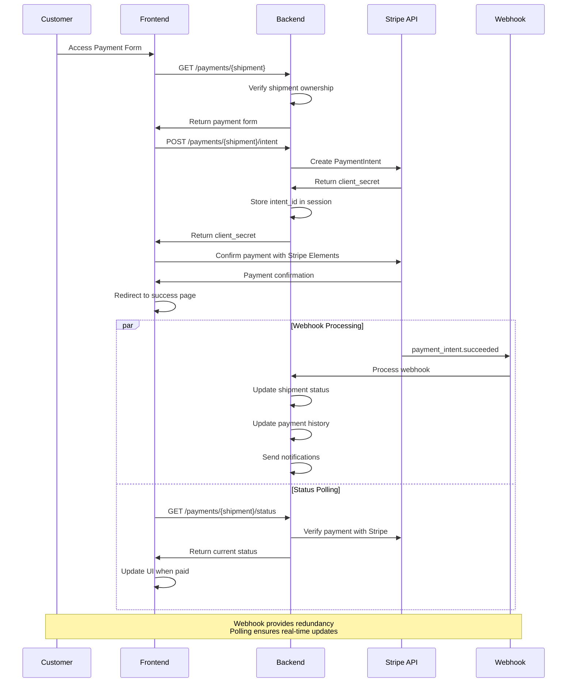
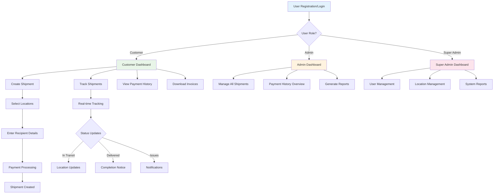

# QuickShip Courier Manager

A comprehensive courier and shipment management system built with Laravel and React (Inertia.js) that handles the complete shipment lifecycle from booking to delivery, including integrated payment processing and tracking.

## 🚀 Features

- **Shipment Management**: Create, track, and manage shipments with real-time status updates
- **Payment Processing**: Secure payment integration with Stripe, including invoice generation
- **User Roles**: Multi-role support (Admin, Super Admin, Customer)
- **Real-time Tracking**: Track shipments with detailed status updates
- **Invoice System**: Generate and manage PDF invoices for completed shipments
- **Location Management**: Manage pickup and delivery locations
- **Notification System**: Real-time notifications for shipment updates
- **Reporting**: Comprehensive reports and analytics dashboard

## 📋 Table of Contents

- [Architecture Overview](#architecture-overview)
- [Database Schema](#database-schema)
- [Payment Flow](#payment-flow)
- [User Journey](#user-journey)
- [Installation](#installation)
- [Configuration](#configuration)
- [API Documentation](#api-documentation)
- [Testing](#testing)
- [Deployment](#deployment)

## 🏗️ Architecture Overview

The application follows a modern web architecture pattern with clear separation of concerns:



## 🗄️ Database Schema

The application uses a well-structured relational database schema:



## 💳 Payment Flow

The payment system implements a robust, secure flow using Stripe:



## 👤 User Journey

Different user roles have distinct workflows:



## 🛠️ Installation

### Prerequisites

- PHP 8.2+
- Composer
- Node.js 18+
- SQLite (or MySQL/PostgreSQL)

### Setup Steps

1. **Clone the repository**
   ```bash
   git clone <repository-url>
   cd quickship-courier-manager
   ```

2. **Install PHP dependencies**
   ```bash
   composer install
   ```

3. **Install Node.js dependencies**
   ```bash
   npm install
   ```

4. **Environment setup**
   ```bash
   cp .env.example .env
   php artisan key:generate
   ```

5. **Database setup**
   ```bash
   php artisan migrate
   php artisan db:seed
   ```

6. **Build frontend assets**
   ```bash
   npm run build
   # For development: npm run dev
   ```

7. **Start the application**
   ```bash
   php artisan serve
   ```

## ⚙️ Configuration

### Environment Variables

```env
# Application
APP_NAME="QuickShip Courier Manager"
APP_ENV=local
APP_DEBUG=true
APP_URL=http://localhost:8000

# Database
DB_CONNECTION=sqlite
# DB_DATABASE=/absolute/path/to/database.sqlite

# Stripe Configuration
STRIPE_KEY=pk_test_...
STRIPE_SECRET=sk_test_...
STRIPE_WEBHOOK_SECRET=whsec_...

# Mail Configuration
MAIL_MAILER=smtp
MAIL_HOST=smtp.mailtrap.io
MAIL_PORT=2525
MAIL_USERNAME=null
MAIL_PASSWORD=null
MAIL_ENCRYPTION=null
MAIL_FROM_ADDRESS="noreply@quickship.com"
MAIL_FROM_NAME="${APP_NAME}"
```

### Key Configuration Files

- `config/cashier.php` - Stripe payment configuration
- `config/inertia.php` - Inertia.js SPA configuration
- `config/filesystems.php` - File storage configuration

## 📚 API Documentation

### Authentication

All API endpoints require authentication via Laravel Sanctum or session-based auth.

### Key Endpoints

#### Shipments
- `GET /shipments` - List user's shipments
- `POST /shipments` - Create new shipment
- `GET /shipments/{shipment}` - Get shipment details
- `PATCH /shipments/{shipment}` - Update shipment
- `DELETE /shipments/{shipment}` - Cancel shipment

#### Payments
- `GET /payments/{shipment}` - Payment form
- `POST /payments/{shipment}/intent` - Create payment intent
- `GET /payments/{shipment}/status` - Check payment status
- `GET /payments/my-history` - User payment history
- `GET /payments/history` - Admin payment history

#### Invoices
- `GET /invoices/{shipment}` - Download invoice
- `GET /invoices/{shipment}?action=view` - View invoice inline
- `GET /invoices/my-invoices` - User invoices
- `GET /invoices/admin` - Admin invoice management

#### Tracking
- `GET /tracking/{tracking_id}` - Public tracking (no auth required)

## 🧪 Testing

### Running Tests

```bash
# Run all tests
php artisan test

# Run specific test suite
php artisan test --testsuite=Feature
php artisan test --testsuite=Unit

# Run with coverage
php artisan test --coverage
```

### Test Structure

```
tests/
├── Feature/
│   ├── ShipmentTest.php
│   ├── PaymentTest.php
│   ├── AuthTest.php
│   └── TrackingTest.php
├── Unit/
│   ├── Models/
│   └── Services/
└── TestCase.php
```

## 🚀 Deployment

### Production Checklist

1. **Environment Configuration**
   - Set `APP_ENV=production`
   - Set `APP_DEBUG=false`
   - Configure real database credentials
   - Set up Stripe live keys

2. **Security**
   - Generate new `APP_KEY`
   - Configure HTTPS
   - Set up proper file permissions
   - Configure CORS settings

3. **Performance**
   - Run `php artisan config:cache`
   - Run `php artisan route:cache`
   - Run `php artisan view:cache`
   - Optimize Composer autoloader: `composer install --optimize-autoloader --no-dev`

4. **Build Assets**
   ```bash
   npm run build
   ```

5. **Database**
   ```bash
   php artisan migrate --force
   ```

### Docker Deployment

A `Dockerfile` and `docker-compose.yml` are provided for containerized deployment:

```bash
docker-compose up -d
```

## 🔧 Development

### Code Style

The project follows PSR-12 coding standards for PHP and uses Prettier for TypeScript/React code.

```bash
# PHP CS Fixer
./vendor/bin/php-cs-fixer fix

# Prettier for frontend
npm run format
```

### Development Tools

- **Laravel Telescope** - Debugging and monitoring
- **Laravel Debugbar** - Development debugging
- **Vite** - Frontend build tool with HMR

## 📊 Performance Monitoring

The application includes several performance monitoring features:

- Database query optimization with Eloquent relationships
- Image optimization and lazy loading
- Frontend code splitting with Vite
- Caching strategies for frequently accessed data

## 🔒 Security Features

- **Authentication**: Laravel Breeze with multi-role support
- **Authorization**: Role-based access control
- **Payment Security**: PCI-compliant payment processing via Stripe
- **CSRF Protection**: Built-in Laravel CSRF protection
- **SQL Injection Prevention**: Eloquent ORM with prepared statements
- **XSS Protection**: Output escaping and Content Security Policy

## 🤝 Contributing

1. Fork the repository
2. Create a feature branch: `git checkout -b feature/amazing-feature`
3. Commit your changes: `git commit -m 'Add amazing feature'`
4. Push to the branch: `git push origin feature/amazing-feature`
5. Open a Pull Request

## 📝 License

This project is licensed under the MIT License - see the [LICENSE](LICENSE) file for details.

## 📞 Support

For support and questions:
- Create an issue in the GitHub repository
- Contact the development team at: dev@quickship.com

---

**Built with ❤️ using Laravel, React, and modern web technologies.**